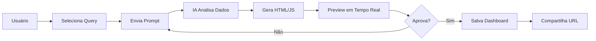

# 🤖 Analytics Builder - IA para BI

## 📋 Visão Geral

O **Analytics Builder** é uma solução revolucionária de Business Intelligence integrada ao DataCare que utiliza **Inteligência Artificial (Google Gemini)** para gerar dashboards HTML dinâmicos a partir de consultas SQL do Oracle (Tasy).

## ✨ Funcionalidades Principais

### 1. **Chat com IA**
- Interface conversacional para criar dashboards
- Suporte a prompts em linguagem natural
- Filtragem dinâmica de dados
- Histórico de conversação

### 2. **Gerenciador de Queries**
- Editor SQL integrado com syntax highlighting
- Biblioteca de consultas salvas
- Teste de queries em tempo real
- Validação automática

### 3. **Templates Pré-definidos**
- **Dashboard de KPIs**: Cards com indicadores principais
- **Análise Temporal**: Gráficos de linha e tendências
- **Comparação por Categoria**: Barras e pizza
- **Resumo Executivo**: Multi-visualização
- **Detalhamento Operacional**: Tabelas e drill-down
- **Métricas de Performance**: SLA e metas

### 4. **Geração Inteligente de Dashboards**
- Detecção automática de tipos de dados
- Escolha inteligente de visualizações
- KPIs calculados dinamicamente
- Múltiplos tipos de gráficos (Chart.js)
- Layout responsivo (TailwindCSS)

### 5. **Visualização e Exportação**
- Preview em tempo real
- Modo visual e código HTML
- Salvamento persistente no PostgreSQL
- Compartilhamento via URL
- *(Futuro)* Exportação para PDF/Excel

## 🏗️ Arquitetura

### Stack Tecnológico
```
Frontend:
├── EJS (Server-Side Rendering)
├── TailwindCSS (Estilização)
├── Chart.js + chartjs-plugin-datalabels (Gráficos)
├── Font Awesome (Ícones)
└── JavaScript Vanilla (Interatividade)

Backend:
├── Node.js + Express
├── Google Generative AI (Gemini 2.5 Flash)
├── Knex.js (Query Builder)
├── PostgreSQL (Armazenamento de widgets)
└── Oracle Database (Fonte de dados - Tasy)
```

### Fluxo de Funcionamento



## 📁 Estrutura de Arquivos

```
src/
├── controllers/
│   └── AnalyticsController.js    # Lógica principal
├── routes/
│   └── analytics.routes.js       # Rotas da API
├── views/pages/analytics/
│   ├── index.ejs                 # Builder principal
│   └── lista.ejs                 # Listagem de dashboards
└── infra/database/
    └── migrations/
        └── 20260103154534_create_sis_indicadores.js
```

## 🗄️ Schema do Banco de Dados

### Tabela: `sis_indicadores`
```sql
CREATE TABLE sis_indicadores (
    id SERIAL PRIMARY KEY,
    titulo VARCHAR NOT NULL,
    descricao TEXT,
    consulta_sql TEXT NOT NULL,
    tipo_grafico VARCHAR DEFAULT 'bar',
    configuracao JSONB DEFAULT '{}',
    grupo_modulo VARCHAR DEFAULT 'Geral',
    ativo BOOLEAN DEFAULT TRUE,
    created_at TIMESTAMP DEFAULT NOW(),
    updated_at TIMESTAMP DEFAULT NOW()
);
```

**Campos:**
- `titulo`: Nome do dashboard
- `descricao`: Descrição do objetivo
- `consulta_sql`: Query Oracle (raw SQL)
- `tipo_grafico`: Tipo principal (bar, line, pie, mixed)
- `configuracao`: JSON com `html_template` gerado pela IA
- `grupo_modulo`: Categoria do dashboard
- `ativo`: Status de ativação

## 🚀 Como Usar

### Passo 1: Acessar o Builder
```
URL: /analytics
```

### Passo 2: Criar/Selecionar uma Query
1. Clique em **"Gerenciar Queries"**
2. Escreva ou selecione uma query Oracle
3. Clique em **"TESTAR"** para validar
4. Clique em **"USAR ESTA QUERY"**

### Passo 3: Gerar Dashboard

**Opção A - Usar Template:**
1. Clique em **"Templates"**
2. Escolha um template pré-definido
3. A IA gerará o dashboard automaticamente

**Opção B - Prompt Personalizado:**
1. Digite no chat: 
   ```
   "Crie um dashboard com 4 KPIs no topo e gráficos de linha e pizza abaixo"
   ```
2. A IA analisará os dados e criará visualizações

### Passo 4: Revisar e Ajustar
- Toggle entre **Visual** e **Código HTML**
- Faça ajustes enviando novos prompts
- Exemplo: "Mude as cores para verde e adicione mais KPIs"

### Passo 5: Salvar
1. Clique em **"Salvar Página"**
2. Digite um nome e descrição
3. Dashboard fica disponível em `/api/analytics/view/{id}`

## 📊 Exemplos de Prompts

### KPIs Simples
```
"Mostre o total, média e máximo em cards coloridos"
```

### Análise Temporal
```
"Crie um gráfico de linha mostrando a evolução mensal dos dados"
```

### Dashboard Completo
```
"Crie um dashboard executivo com:
- 6 KPIs no topo
- Gráfico de linha para tendência
- Gráfico de barras para comparação
- Gráfico de pizza para distribuição percentual"
```

### Com Filtros
```
Filtro: "Apenas ano 2025"
Prompt: "Mostre a distribuição por categoria em gráfico de pizza"
```

## 🎨 Customização de Cores

O sistema usa a paleta do DataCare:
- **Primária**: Blue-600 (`#2563EB`)
- **Sucesso**: Green-600 (`#16A34A`)
- **Alerta**: Orange-600 (`#EA580C`)
- **Erro**: Red-600 (`#DC2626`)
- **Info**: Purple-600 (`#9333EA`)

## 🔐 Segurança

- ✅ Autenticação obrigatória (`loginRequired` middleware)
- ✅ Queries executadas em modo read-only
- ✅ Sanitização de inputs
- ✅ Limite de 200 registros por query
- ✅ Timeout de 30 segundos nas queries
- ⚠️ **NÃO** use queries com `DELETE`, `UPDATE`, `DROP`

## 📈 Performance

### Otimizações Implementadas
- Uso de `FETCH FIRST 200 ROWS ONLY` no Oracle
- Cálculo de KPIs no cliente (JavaScript)
- Cache de templates
- Lazy loading de gráficos

### Recomendações
- Queries com `WHERE` para filtrar dados
- Índices nas tabelas Oracle
- Agregações no SQL quando possível

## 🐛 Troubleshooting

### "Erro SQL: ORA-00942"
**Causa:** Tabela não existe ou sem permissão
**Solução:** Verifique permissões no Oracle

### "Retorno vazio"
**Causa:** Query não retornou dados
**Solução:** Ajuste os filtros ou WHERE

### "Dashboard sem gráficos"
**Causa:** Dados não compatíveis
**Solução:** Certifique-se de ter colunas com labels e valores

### "IA não respondeu"
**Causa:** API Key inválida ou limite excedido
**Solução:** Verifique `GEMINI_API_KEY` no `.env`

## 🔮 Roadmap

### Versão Atual (v1.0)
- ✅ Chat com IA
- ✅ Gerenciador de Queries
- ✅ Templates pré-definidos
- ✅ Geração dinâmica de dashboards
- ✅ Salvamento no PostgreSQL

### Próximas Versões
- [ ] **v1.1**: Exportação para PDF (Puppeteer)
- [ ] **v1.2**: Exportação para Excel (ExcelJS)
- [ ] **v1.3**: Agendamento de dashboards (envio por email)
- [ ] **v1.4**: Compartilhamento público (links sem login)
- [ ] **v1.5**: Editor de layout drag-and-drop
- [ ] **v2.0**: Multi-tenant (suporte a múltiplos hospitais)

## 📞 Suporte

**Desenvolvedor:** Marlon Filho  
**Projeto:** DataCare - Sistema Hospitalar  
**Tecnologia:** Node.js + Express + Google Gemini AI  
**Licença:** Proprietária

---

## 🎯 Casos de Uso

### 1. Dashboard de Ocupação UTI
```sql
SELECT 
    TO_CHAR(DT_ENTRADA, 'MM/YYYY') AS MES,
    COUNT(*) AS TOTAL_PACIENTES,
    AVG(TEMPO_PERMANENCIA) AS MEDIA_DIAS
FROM agenda_paciente
WHERE DT_ENTRADA >= TRUNC(ADD_MONTHS(SYSDATE, -12))
GROUP BY TO_CHAR(DT_ENTRADA, 'MM/YYYY')
ORDER BY 1
FETCH FIRST 200 ROWS ONLY
```

**Prompt:** "Crie um dashboard de ocupação da UTI com gráfico de linha mostrando a evolução mensal e cards com total de pacientes e média de permanência"

### 2. Top 10 Médicos por Atendimento
```sql
SELECT 
    NM_MEDICO,
    COUNT(*) AS TOTAL_ATENDIMENTOS,
    AVG(SATISFACAO) AS MEDIA_SATISFACAO
FROM agenda_consulta
WHERE DT_AGENDA >= TRUNC(ADD_MONTHS(SYSDATE, -3))
GROUP BY NM_MEDICO
ORDER BY 2 DESC
FETCH FIRST 10 ROWS ONLY
```

**Prompt:** "Mostre o ranking dos médicos em gráfico de barras horizontais coloridas com o total de atendimentos"

### 3. Distribuição de Convênios
```sql
SELECT 
    DS_CONVENIO,
    COUNT(*) AS QUANTIDADE,
    SUM(VL_FATURADO) AS VALOR_TOTAL
FROM faturamento
WHERE DT_FATURAMENTO >= TRUNC(ADD_MONTHS(SYSDATE, -1))
GROUP BY DS_CONVENIO
FETCH FIRST 200 ROWS ONLY
```

**Prompt:** "Crie um gráfico de pizza mostrando a distribuição percentual dos convênios e cards com o total faturado"

---

**Última Atualização:** 21/01/2026  
**Versão:** 1.0.0
